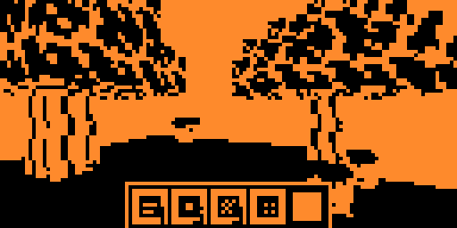
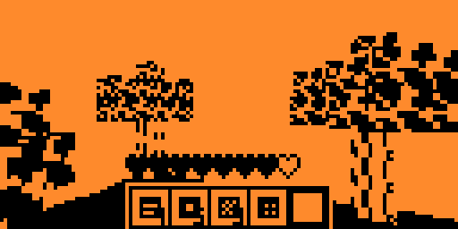
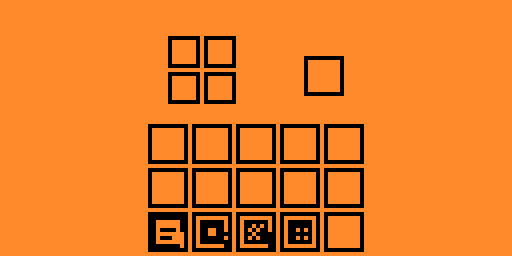
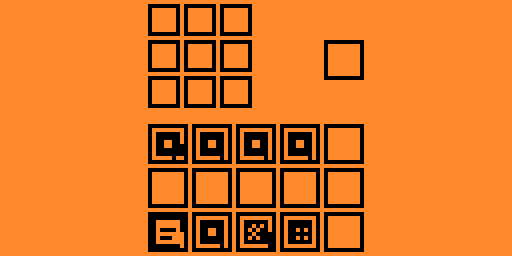
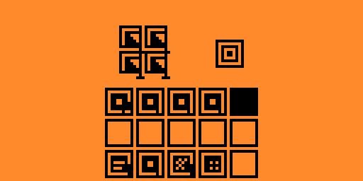
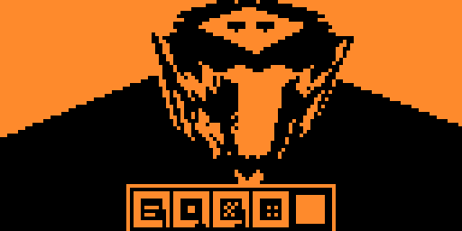
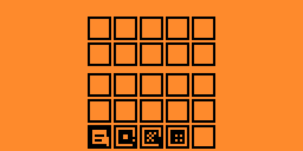
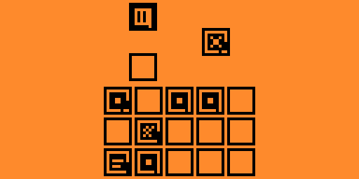
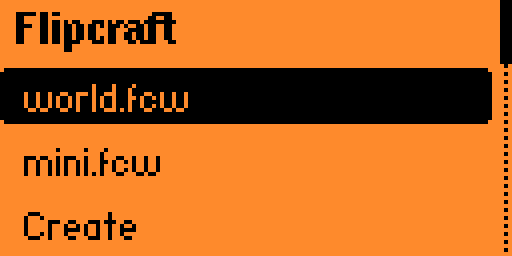
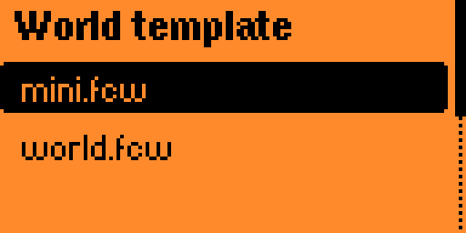

# Flipcraft

## Screenshots

| World | World | Inventory |
|---|---|---|
|  |  |  |

| Crafting | Crafting | Crafting |
|---|---|---|
|  |  |  |

| Storage | Furnace | Menu |
|---|---|---|
|  |  |  |

| Menu | Menu |
|---|---|
|  |  |

## Controls

### World

- `Up` / `Down`: move forward / backward
- `Left` / `Right`: turn left / right
- `Ok` + `Up` / `Down`: look up / down
- `Ok` + `Left` / `Right`: select previous / next hotbar slot
- `Ok` short press: place block or use the targeted station
- `Ok` long press: mine or break the targeted block
- `Back` short press: jump
- `Back` long press: open inventory

### Menus

- `Up` / `Down` / `Left` / `Right`: move cursor
- `Ok`: pick up, place, or take output
- `Ok` + arrow: drop one held item per slot crossed
- `Back`: close menu

### System

- `Ok` + `Back`: quit (bug press first "OK")
